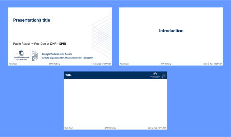

# beamer-SPIN
SPIN theme for beamer. The theme has not been thoroughly tested.

Here is a sample of the slides.

## Install (OS dependent. Tested using Linux Mint 21.3 Cinnamon)
Install the the theme by placing the .sty in an appropriate beamer's theme location (e.g. ~/texmf/tex/latex/beamer/). The files in the img folder can also be made by placing them in global or local folders (e.g. ~/texmf/tex/latex/images/).

## Fonts
To use the Roboto font you need to compile with XeLaTex or LuaLaTex. With pdfLaTeX you will have the default latex fonts instead.
